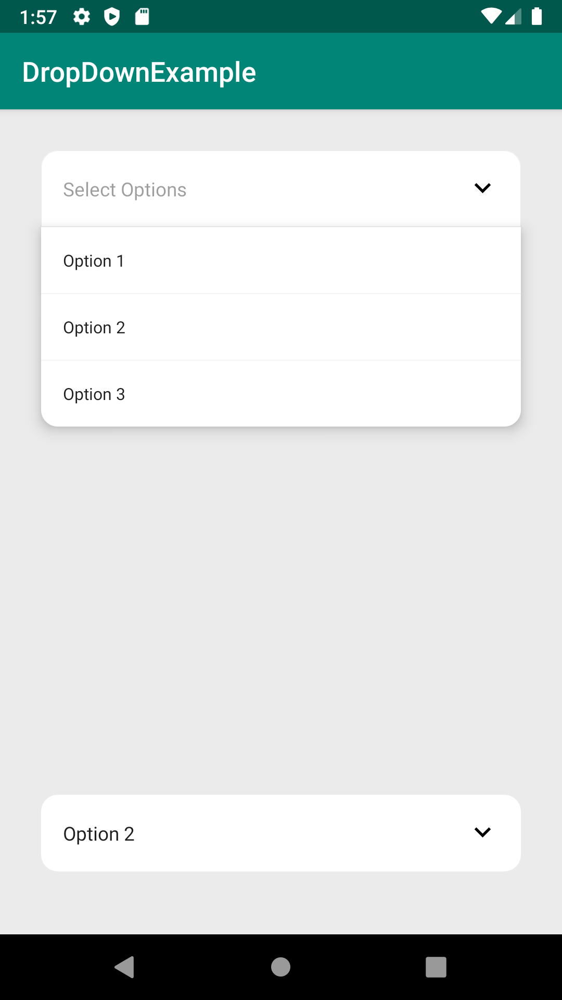

# DropDownTextView

A light weight library for simple DropDown Solution with TextView.


## How to
To get this project into your build:
### Step 1
Open project level gradle file
Add the JitPack repository to your build file
Add it in your root build.gradle at the end of repositories:
```java
allprojects {
    repositories {
    	...
    	maven { url 'https://jitpack.io'}
    }
}
```
### Step 1
Open app module gradle file and add the dependency
```gradle
dependencies {
	implementation 'com.github.UmairKhalid786:DropDownTextView:1.0'
}
```
### How to use it ?
After following above mentioned steps you are ready to code , Sample code is pasted from example given in this repo.

```xml
 <com.techlad.dropdowntextview.DropDownTextView
        android:id="@+id/optionsTv"
        style="@style/DropDownTv"
        android:padding="16dp"
        android:hint="Select Options"
        android:layout_width="match_parent"
        android:layout_height="wrap_content"  />

```

```kotlin
        //Simple Text Array
        val arrayList = arrayListOf<String>()

        arrayList.add("Option 1")
        arrayList.add("Option 2")
        arrayList.add("Option 3")

        //Set dropDown options to our custom textView and Boom you are done with it
        optionsTv.setOptions(arrayList)

        //This is how you set click listener
        optionsTv.setClickListener(object : DropDownTextView.DropDownClickListener{
            override fun onDropDownClick(value: String?, index: Int) {
                //Value and index of selected item
            }
        })

        //As it is textview so you can get selected text
        var text = optionsTv.text.toString()

        /*
        Second dropdown for bottom example
        It will auto adjust space according to available screen
        */
        options2Tv.setOptions(arrayList)
```

### Output

[](https://github.com/UmairKhalid786/DropDownTextView/tree/master/screenshots/bottom.png  "smoutput")
